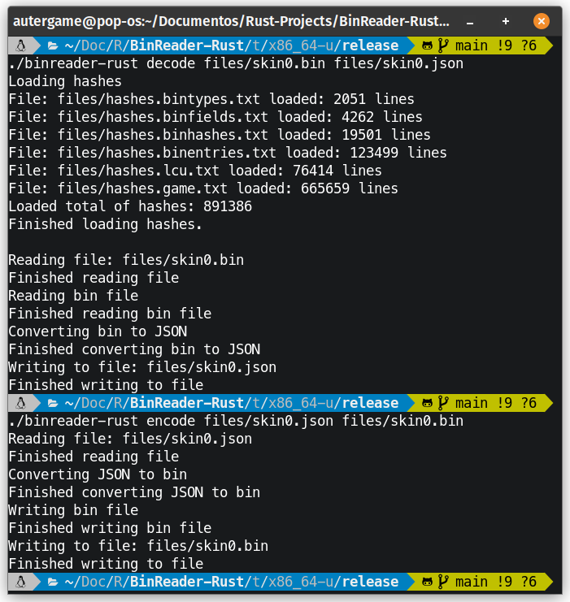

# BinReader-Rust
League Of Legends Bin Reader And Writter In Rust

### Hashes at:
* https://github.com/CommunityDragon/CDTB/tree/master/cdragontoolbox

## Help From:
* https://github.com/autergame/BinReader
* https://github.com/moonshadow565/ritobin
* https://github.com/LoL-Fantome/LeagueToolkit
* https://github.com/CommunityDragon/CDTB
* https://github.com/DaveGamble/cJSON

## How to use: 

decode bin to json:
```
binreader-rust decode skin0.bin skin0.json
binreader-rust decode *.bin
```

encode json to bin: 
```
binreader-rust encode skin0.json skin0.bin
binreader-rust encode *.json
```

